# USER GUIDE INDOTIX

## Mitra Wisata

Panduan Penggunaan Platform INDOTIX

Edisi 15 September 2026 • Referensi aplikasi 6e12e5a

## Daftar isi

1. [Mengenal INDOTIX](#mulai)
2. [Registrasi dan verifikasi email](#registrasi)
3. [Login dan pemulihan akses](#login)
4. [Mendaftarkan destinasi wisata](#pendaftaran)
5. [Dashboard dan status akun](#dashboard)
6. [Memperbarui profil destinasi](#destinasi)
7. [Membuat dan mengelola tiket](#tiket)
8. [Memantau booking wisata](#booking)
9. [QR Masuk dan validasi kunjungan](#qr)
10. [Pendapatan dan payout](#keuangan)
11. [Membaca notifikasi](#notifikasi)
12. [Menanggapi ulasan pengunjung](#ulasan)
13. [Laporan masalah dan Live Chat](#bantuan)
14. [Profil, keamanan, dan logout](#akun)

## 01 Mengenal INDOTIX

### Tujuan

INDOTIX membantu pengelola destinasi menyiapkan informasi wisata, menjual tiket, memantau booking, dan mengelola kunjungan. Panduan ini ditujukan kepada pemilik atau pengelola akun Mitra Wisata.

### Cara mengakses

Buka https://indotix.co.id melalui browser.

### Langkah penggunaan

1. Siapkan email aktif, nomor telepon, data penanggung jawab, lokasi destinasi, foto, dokumen usaha, serta data rekening.
2. Daftarkan akun Mitra dan verifikasi email. Lengkapi pendaftaran usaha, lalu tunggu pemeriksaan admin.
3. Setelah usaha terverifikasi, siapkan tiket, pantau booking, pasang QR Masuk, dan tinjau pendapatan.

**Hasil:** Anda memahami urutan persiapan hingga operasional harian.

> **Perhatian:** Gambar dalam panduan diambil dari aplikasi lokal yang sama dengan source saat audit, menggunakan data contoh. Nama, transaksi, rekening, dan angka komisi pada contoh bukan data pelanggan atau ketentuan komersial Anda.

## 02 Registrasi dan verifikasi email

### Tujuan

Buat akun dengan jenis Mitra agar Anda dapat mendaftarkan destinasi wisata.

### Cara mengakses

Halaman Masuk → Daftar sekarang → Mitra

### Langkah penggunaan

1. Pilih Mitra. Isi nama lengkap, email, nomor HP, password, dan konfirmasi password.
2. Baca Syarat dan Ketentuan serta Kebijakan Privasi, centang persetujuan, lalu klik Buat akun.
3. Buka email dari INDOTIX dan klik tautan verifikasi. Jika belum diterima, periksa spam lalu gunakan Kirim ulang link verifikasi.
4. Setelah email terverifikasi, buka Dashboard Mitra dan klik Daftar Wisata.

**Hasil:** Akun masuk ke alur Pendaftaran Mitra Wisata.

> **Perhatian:** Verifikasi web menggunakan tautan email. Jangan memberikan password atau tautan verifikasi kepada pihak lain. Verifikasi email berbeda dari persetujuan usaha oleh admin.

### Pilih jenis akun Mitra

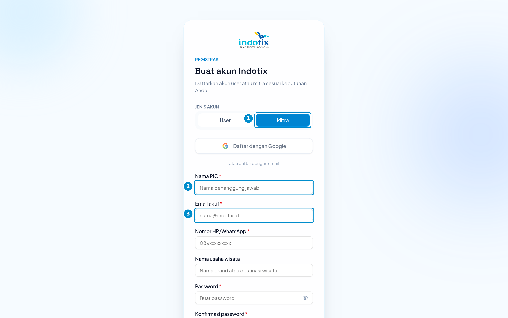

**1. Mitra**
Pilih jenis akun Mitra sebelum mengisi formulir.

**2. Nama**
Isi nama lengkap penanggung jawab akun.

**3. Email**
Gunakan email yang dapat Anda akses.

### Lengkapi data dan persetujuan

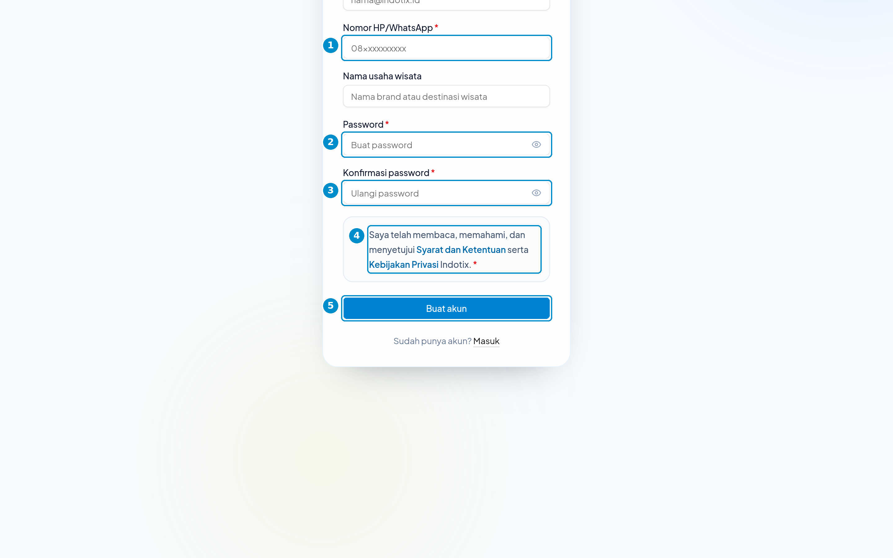

**1. Nomor HP**
Isi nomor kontak aktif.

**2. Password**
Buat password dan ulangi pada konfirmasi.

**3. Konfirmasi password**
Harus sama dengan password di atas.

**4. Persetujuan**
Baca Syarat dan Ketentuan serta Kebijakan Privasi, lalu centang persetujuan.

**5. Buat akun**
Kirim formulir registrasi.

### Memverifikasi email akun

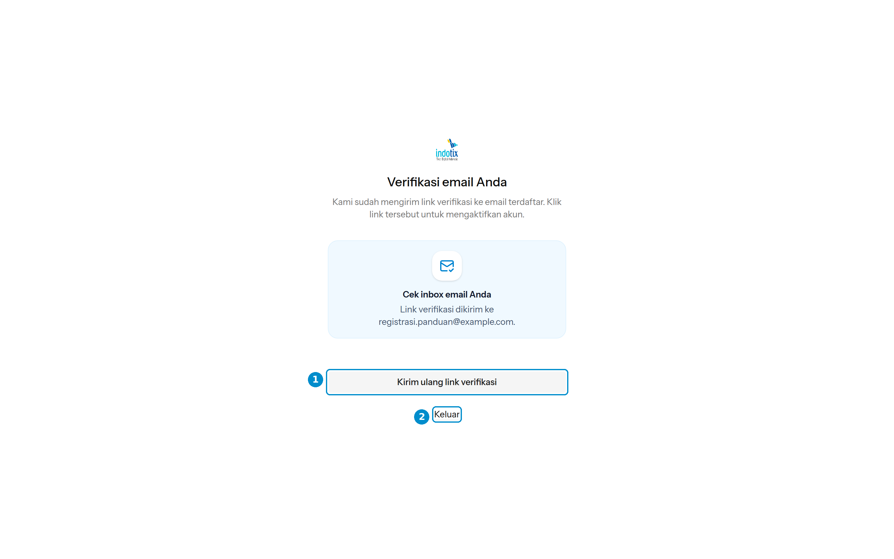

**1. Kirim ulang link verifikasi**
Gunakan jika tautan belum diterima; periksa folder spam terlebih dahulu.

**2. Keluar**
Akhiri sesi jika ingin menggunakan akun lain.

### Memulai pendaftaran Mitra Wisata

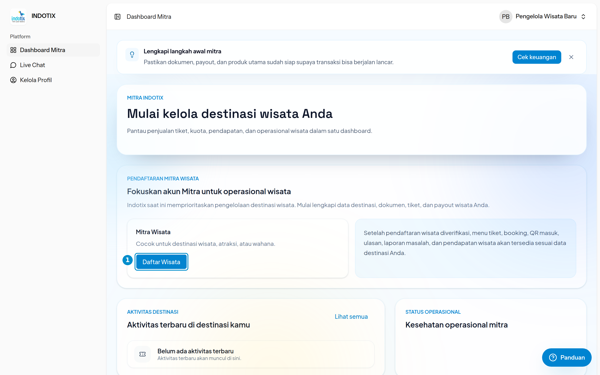

**1. Daftar Wisata**
Pilih untuk melengkapi data usaha wisata.

## 03 Login dan pemulihan akses

### Tujuan

Masuk menggunakan akun Mitra yang sudah terdaftar.

### Cara mengakses

INDOTIX → Masuk

### Langkah penggunaan

1. Isi Email terdaftar dan Password.
2. Klik Masuk sekarang. Gunakan Ingat saya hanya pada perangkat pribadi.
3. Jika lupa password, klik Lupa password?, masukkan email, lalu klik Email password reset link.
4. Buka tautan pemulihan di email. Isi Password dan Confirm password yang sama, klik Reset password, lalu masuk kembali.

**Hasil:** Akun terverifikasi dapat membuka dashboard; akun yang belum memverifikasi email diminta menyelesaikan verifikasi.

> **Perhatian:** Jika akun ditangguhkan atau akses tetap ditolak, hubungi admin INDOTIX. Pengiriman email dapat dipengaruhi konfigurasi layanan email. Jangan membagikan tautan pemulihan akses.

### Masuk ke akun Mitra

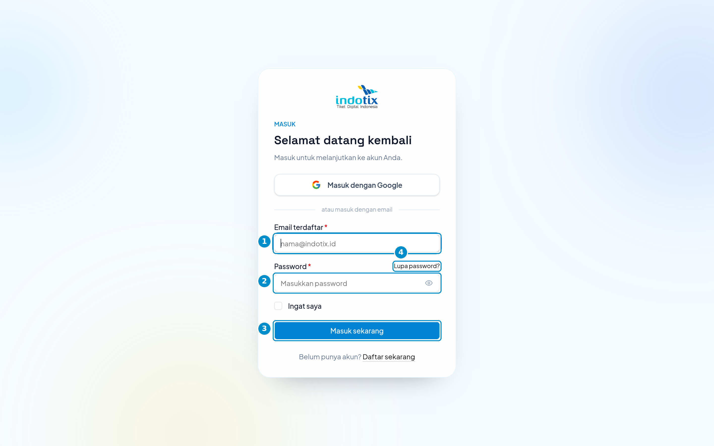

**1. Email terdaftar**
Masukkan alamat email akun Mitra.

**2. Password**
Masukkan password akun Anda.

**3. Masuk sekarang**
Klik untuk masuk; akun yang belum terverifikasi diarahkan ke verifikasi email.

**4. Lupa password?**
Buka pemulihan bila lupa password.

### Memulihkan akses akun

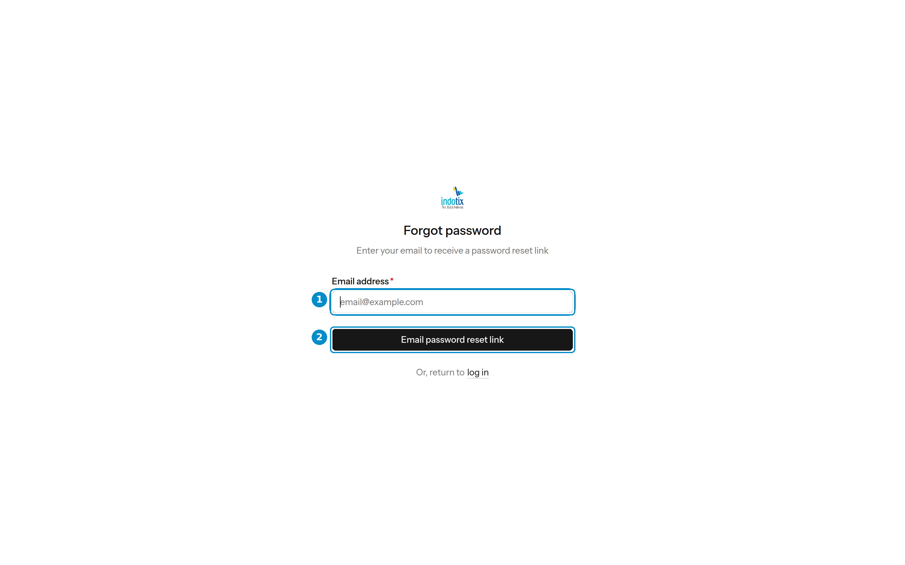

**1. Email**
Isi email yang terdaftar.

**2. Email password reset link**
Kirim tautan pemulihan ke email terdaftar.

### Menetapkan password pengganti

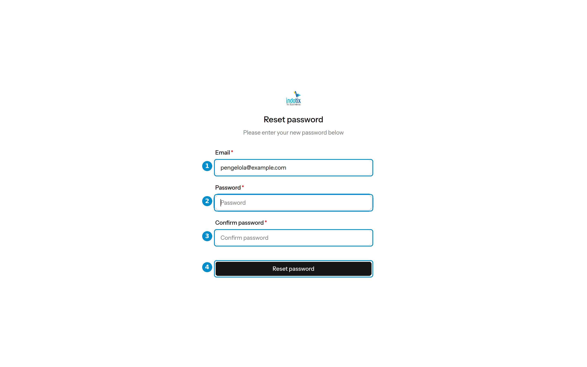

**1. Email**
Pastikan akun yang akan dipulihkan sudah benar.

**2. Password**
Isi password baru yang unik.

**3. Confirm password**
Ulangi password baru yang sama.

**4. Reset password**
Simpan password baru, lalu masuk kembali.

## 04 Mendaftarkan destinasi wisata

### Tujuan

Lengkapi tiga kelompok data untuk pemeriksaan usaha. Akun Mitra mengelola profil destinasi yang terhubung dengan pendaftaran ini.

### Cara mengakses

Dashboard Mitra → Daftar Wisata / Lengkapi dokumen

### Langkah penggunaan

1. Pada Akun Mitra, isi nama lengkap penanggung jawab, nomor HP, dan jabatan. Klik Simpan.
2. Buka Data Destinasi Wisata. Isi nama, jenis, deskripsi, provinsi, kota/kabupaten, alamat lengkap, dan tautan titik Google Maps.
3. Pilih hari buka serta jam buka dan tutup. Isi fasilitas, catatan hari libur, serta kontak operasional jika diperlukan.
4. Unggah foto gerbang/pintu masuk, area utama, dan loket/validasi. Klik Simpan.
5. Buka Legalitas & Keuangan. Unggah KTP, pilih jenis legalitas, isi nomor dokumen dan unggah berkasnya. Selfie dengan KTP disarankan.
6. Isi nama bank, nomor rekening dan nama pemilik rekening. Klik Simpan.
7. Periksa Checklist kelengkapan. Setelah semua persyaratan terpenuhi, gunakan Kirim Verifikasi dan tunggu pemeriksaan admin.

**Hasil:** Setiap kelompok data tersimpan; pengajuan lengkap berstatus pending sampai admin memeriksa.

> **Perhatian:** Foto: JPG/JPEG/PNG/WEBP maksimal 5 MB per file. KTP dan dokumen legal juga menerima PDF sesuai field. Tiga field rekening harus lengkap; nomor rekening 6-30 digit. Tombol pengajuan hanya muncul ketika kelengkapan memenuhi syarat. Jangan menganggap Simpan sebagai persetujuan usaha.

### Mengisi penanggung jawab

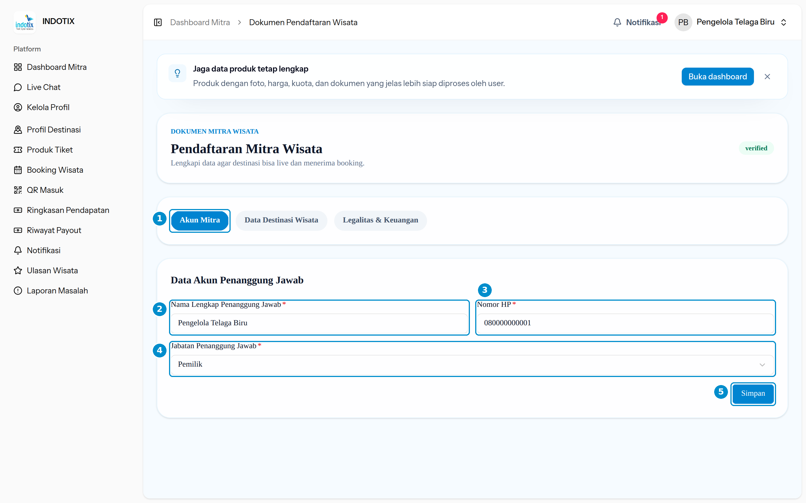

**1. Akun Mitra**
Kelompok data penanggung jawab.

**2. Nama penanggung jawab**
Isi nama yang sesuai dokumen.

**3. Nomor HP**
Gunakan nomor yang dapat dihubungi.

**4. Jabatan**
Pilih jabatan sesuai kewenangan Anda.

**5. Simpan**
Simpan kelompok data sebelum melanjutkan.

### Mengisi identitas destinasi

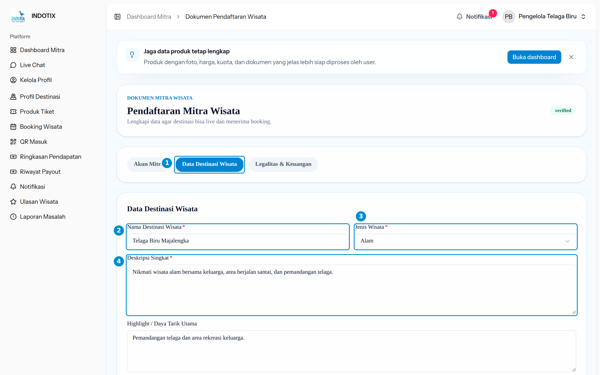

**1. Data Destinasi Wisata**
Buka kelompok informasi destinasi.

**2. Nama Destinasi Wisata**
Gunakan nama yang dikenal pengunjung.

**3. Jenis Wisata**
Pilih kategori yang sesuai.

**4. Deskripsi Singkat**
Jelaskan daya tarik dan layanan destinasi.

### Mengisi lokasi dan jam kunjungan

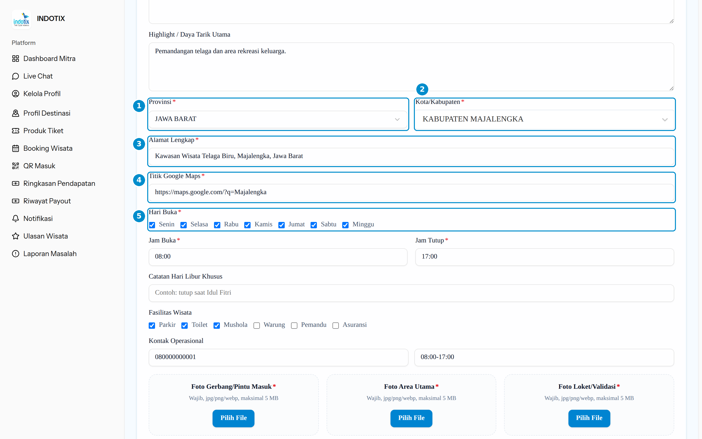

**1. Provinsi**
Pilih provinsi destinasi.

**2. Kota/Kabupaten**
Pilih wilayah destinasi.

**3. Alamat Lengkap**
Isi alamat yang dapat diikuti pengunjung.

**4. Titik Google Maps**
Tempel tautan pin lokasi yang benar.

**5. Hari Buka**
Pilih hari operasional.

### Melengkapi foto pendaftaran

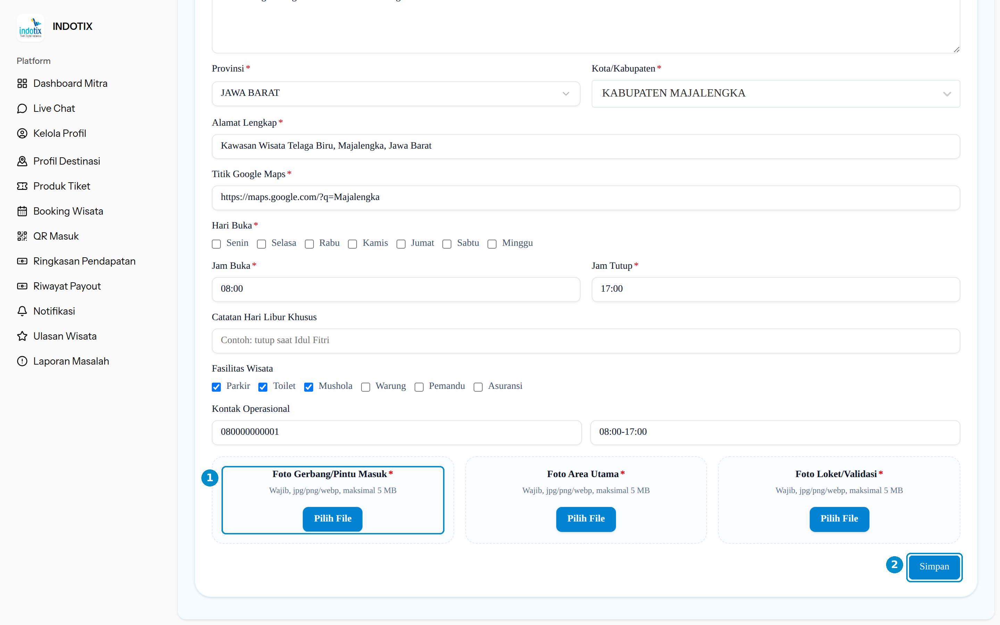

**1. Foto gerbang**
Unggah JPG, PNG, atau WEBP maksimal 5 MB per file.

**2. Simpan**
Simpan data destinasi, termasuk foto area utama dan loket/validasi.

### Mengunggah dokumen legalitas

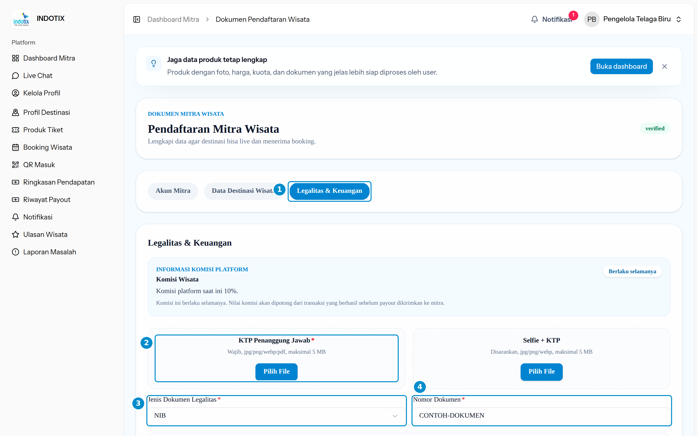

**1. Legalitas & Keuangan**
Buka dokumen dan data rekening.

**2. KTP**
Unggah dokumen sesuai format dan ukuran yang ditentukan.

**3. Jenis dokumen**
Pilih jenis legalitas usaha yang dimiliki.

**4. Nomor dokumen**
Isi sesuai berkas yang diunggah.

### Mengisi rekening penerima

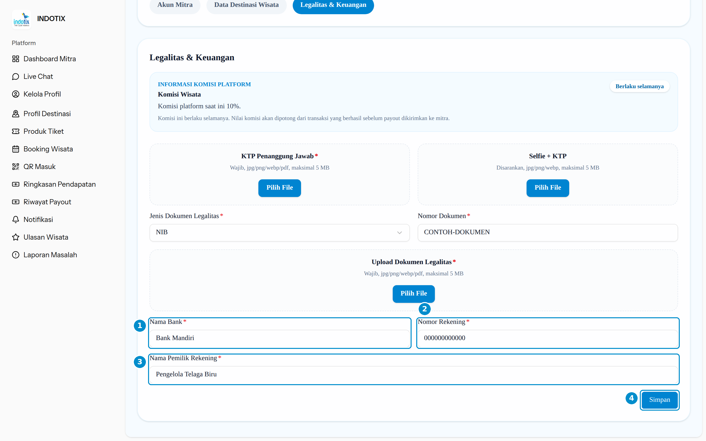

**1. Nama Bank**
Isi nama bank tujuan.

**2. Nomor Rekening**
Gunakan 6-30 digit angka.

**3. Nama Pemilik Rekening**
Harus sesuai pemilik rekening.

**4. Simpan**
Simpan legalitas dan data keuangan.

### Memeriksa kelengkapan pengajuan

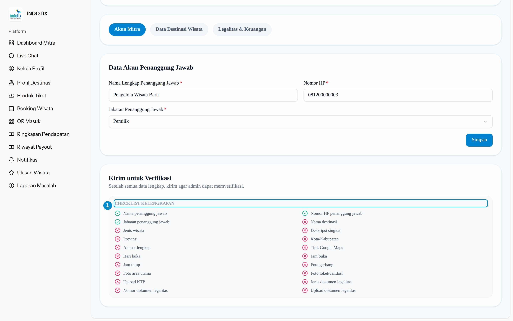

**1. Checklist kelengkapan**
Lengkapi setiap persyaratan yang belum terpenuhi; tombol Kirim Verifikasi muncul setelah data siap.

### Mengirim pendaftaran untuk verifikasi

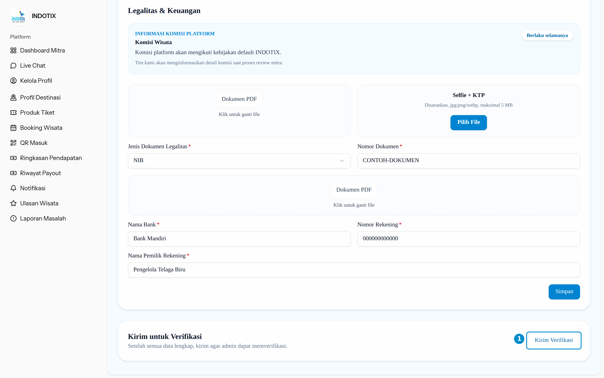

**1. Kirim Verifikasi**
Kirim setelah seluruh data dan dokumen diperiksa. Contoh berkas pada lingkungan dokumentasi bukan identitas atau izin usaha nyata.

## 05 Dashboard dan status akun

### Tujuan

Gunakan dashboard sebagai pemeriksaan awal sebelum membuka operasional.

### Cara mengakses

Menu Dashboard Mitra

### Langkah penggunaan

1. Periksa Tiket Terjual Hari Ini, Pendapatan Bulan Ini, dan Kuota Tersedia Hari Ini.
2. Periksa status Verifikasi dan Payout. Draft berarti belum diajukan; pending sedang diperiksa; verified telah disetujui; rejected memerlukan tindak lanjut.
3. Periksa Aktivitas Destinasi dan Status Operasional. Klik Lihat semua pada aktivitas untuk membuka booking.
4. Jika dokumen kerja sama tampil, buka PDF dan baca seluruh isinya. Centang persetujuan lalu klik Kirim tanda tangan.

**Hasil:** Anda mengetahui kesiapan akun, kondisi tiket, dan aktivitas terbaru.

> **Perhatian:** Tiket hari ini dihitung berdasarkan tanggal kunjungan pada booking paid/completed. Pendapatan bulan ini tidak sama dengan saldo yang sudah dicairkan. Persetujuan dokumen hanya tampil bila admin telah menyediakan dokumen kerja sama.

### Membaca ringkasan dashboard

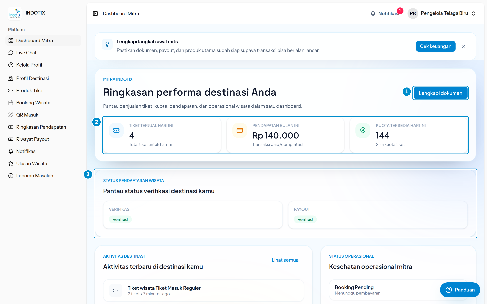

**1. Lengkapi dokumen**
Buka data pendaftaran dan kelengkapan dokumen.

**2. Indikator utama**
Lihat tiket hari ini, pendapatan bulan ini, dan sisa kuota.

**3. Status pendaftaran**
Periksa verifikasi usaha dan rekening secara terpisah.

### Memantau aktivitas dan operasional

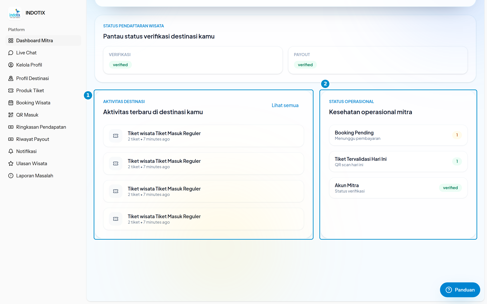

**1. Aktivitas destinasi**
Lihat booking terbaru dan buka Lihat semua untuk daftar booking.

**2. Status operasional**
Pantau booking pending, validasi hari ini, dan status akun.

### Menyetujui dokumen kerja sama

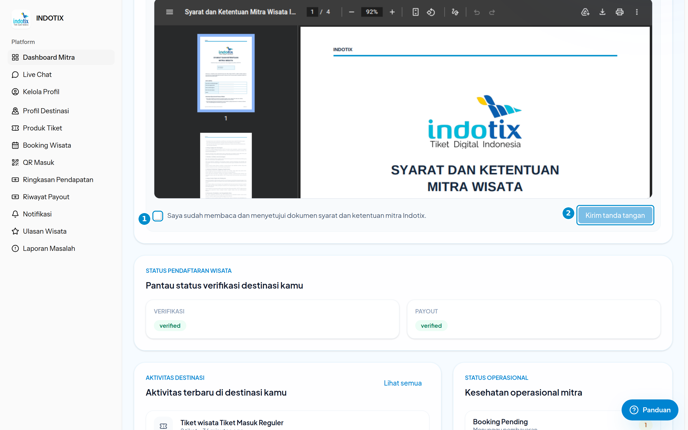

**1. Persetujuan**
Centang hanya setelah membaca dan menyetujui dokumen kerja sama.

**2. Kirim tanda tangan**
Catat persetujuan dan kirim salinan dokumen ke email akun.

## 06 Memperbarui profil destinasi

### Tujuan

Jaga informasi publik destinasi tetap akurat sebelum menawarkan tiket.

### Cara mengakses

Menu Profil Destinasi

### Langkah penggunaan

1. Perbarui penanggung jawab, nama destinasi, jenis wisata, deskripsi, dan highlight. Nama, jenis, provinsi, kota/kabupaten dan alamat lengkap wajib diisi.
2. Periksa alamat, pin Google Maps, hari buka, jam operasional, fasilitas dan kontak.
3. Aktifkan tutup sementara hanya bila destinasi tidak menerima kunjungan; isi catatan penutupannya.
4. Perbarui dokumen atau rekening bila diperlukan. Jangan memakai data rekening milik pihak yang tidak berwenang.
5. Unggah Foto Produk sebagai gambar utama, lalu foto gerbang, area utama dan loket. Foto Lainnya maksimal lima.
6. Klik Simpan Perubahan, tunggu hasil penyimpanan, lalu periksa kembali nilai yang tampil.

**Hasil:** Informasi destinasi tersimpan untuk akun Mitra Anda.

> **Perhatian:** Status publikasi dan penangguhan tetap mengikuti pengelolaan admin. Pada akun Mitra terverifikasi, halaman ini mengedit destinasi yang sudah dimiliki; tidak ada alur Tambah Destinasi kedua.

### Memperbarui profil destinasi

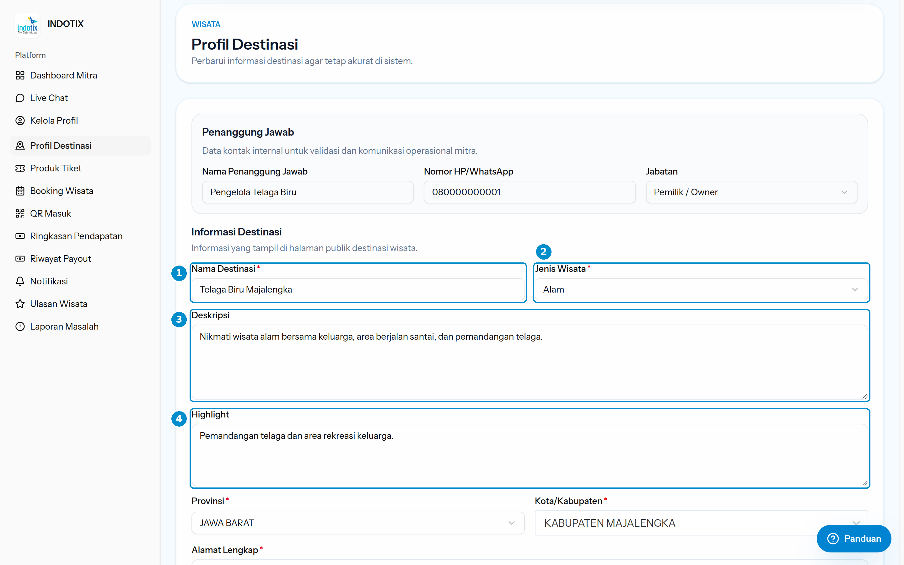

**1. Nama Destinasi**
Perbarui nama publik destinasi.

**2. Jenis Wisata**
Pilih kategori atau jenis lainnya bila tersedia.

**3. Deskripsi**
Jelaskan informasi yang diperlukan calon pengunjung.

**4. Highlight**
Ringkas daya tarik utama.

### Mengatur operasional dan fasilitas

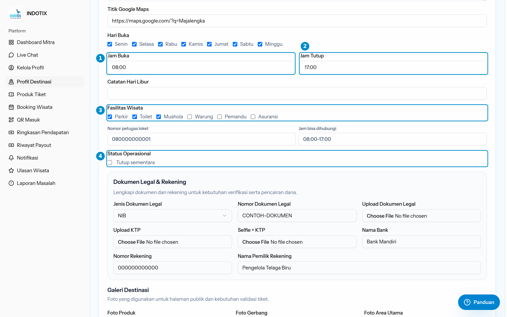

**1. Jam Buka**
Tetapkan jam mulai kunjungan.

**2. Jam Tutup**
Tetapkan jam berakhir kunjungan.

**3. Fasilitas**
Pilih fasilitas yang benar-benar tersedia.

**4. Status Operasional**
Gunakan tutup sementara saat destinasi tidak menerima kunjungan.

### Mengganti foto destinasi

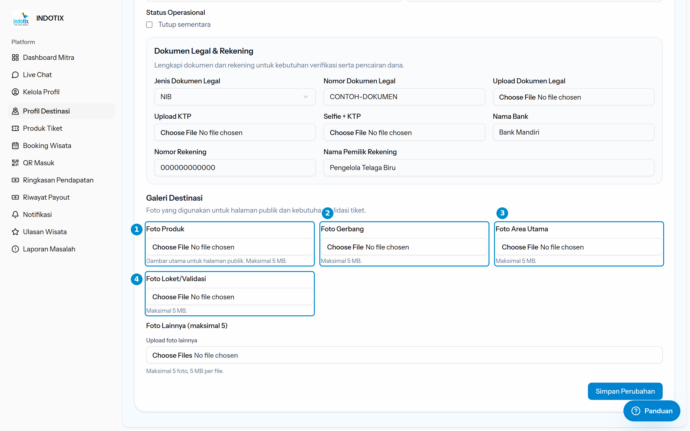

**1. Foto Produk**
Gambar utama untuk halaman publik.

**2. Foto Gerbang**
Gunakan foto akses masuk destinasi.

**3. Foto Area Utama**
Tampilkan area wisata yang representatif.

**4. Foto Loket/Validasi**
Tunjukkan lokasi penerimaan pengunjung.

### Menyimpan perubahan destinasi

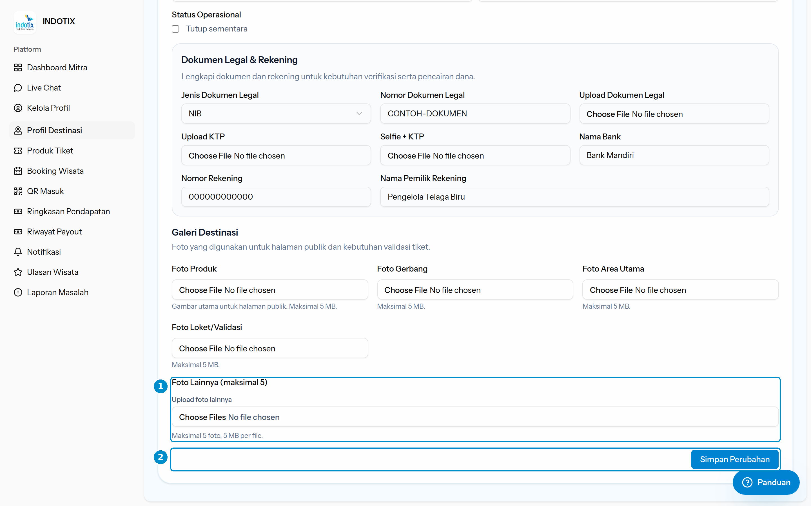

**1. Foto lainnya**
Tambahkan maksimal lima gambar pendukung, masing-masing maksimal 5 MB.

**2. Simpan perubahan**
Simpan lalu periksa kembali data yang tampil.

## 07 Membuat dan mengelola tiket

### Tujuan

Atur produk yang dapat dibeli pengunjung, termasuk harga dan kapasitas.

### Cara mengakses

Menu Produk Tiket → Tambah Tiket

### Langkah penggunaan

1. Isi Nama Tiket, Harga (Rp), Kuota Total, serta deskripsi bila diperlukan.
2. Isi Kuota Harian bila perlu. Atur minimum dan maksimum pembelian secara wajar; batas formulir 1-20 dan maksimum tidak boleh lebih kecil dari minimum.
3. Pilih Jenis Tiket Perorangan atau Grup. Pada Jenis Produk, pilih Tiket satuan atau Paket wisata.
4. Untuk paket, pilih tiket satuan dari destinasi yang sama dan jumlah masing-masing. Harga paket dihitung dari komponen yang dipilih.
5. Atur masa berlaku dan Kebijakan Refund bila digunakan. Centang Aktifkan tiket untuk produk siap jual; Tutup penjualan sementara menghentikan penjualan sementara.
6. Klik Simpan. Kembali ke daftar dan periksa nama, harga, kuota, serta status.
7. Gunakan Edit untuk perubahan berikutnya. Untuk Hapus, isi alasan dan konfirmasi; Batal menutup dialog tanpa menghapus.

**Hasil:** Tiket baru tampil pada daftar Produk Tiket dan dapat ditinjau ulang.

> **Perhatian:** Tiket terusan atau aktivitas di dalam destinasi memerlukan tiket masuk saat pembelian. Pengisian Kebijakan Refund hanya menjelaskan kebijakan produk, bukan tombol pemrosesan refund. Sebelum menghapus, pastikan produk tidak masih diperlukan untuk operasional.

### Mengelola produk tiket

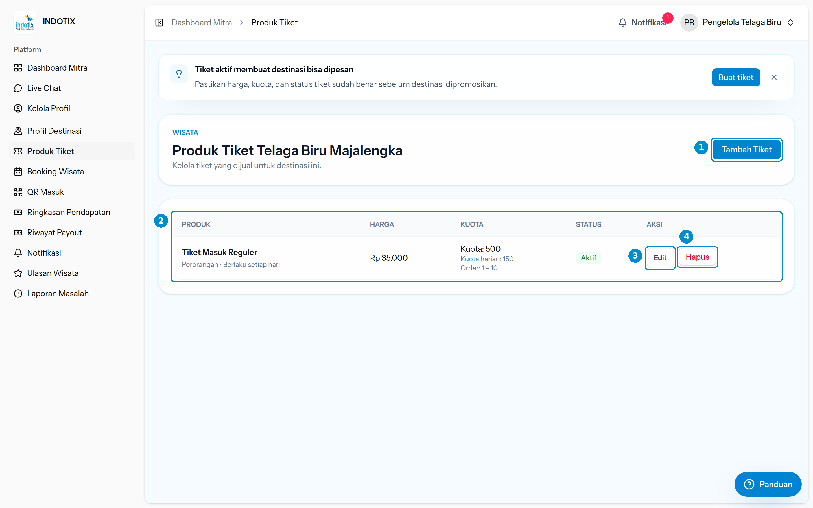

**1. Tambah Tiket**
Buka formulir produk baru.

**2. Daftar tiket**
Bandingkan nama, harga, kuota dan status.

**3. Edit**
Buka tiket yang ingin diperbarui.

**4. Hapus**
Hapus hanya tiket yang memang tidak diperlukan; alasan wajib diisi.

### Mengisi harga dan kuota tiket

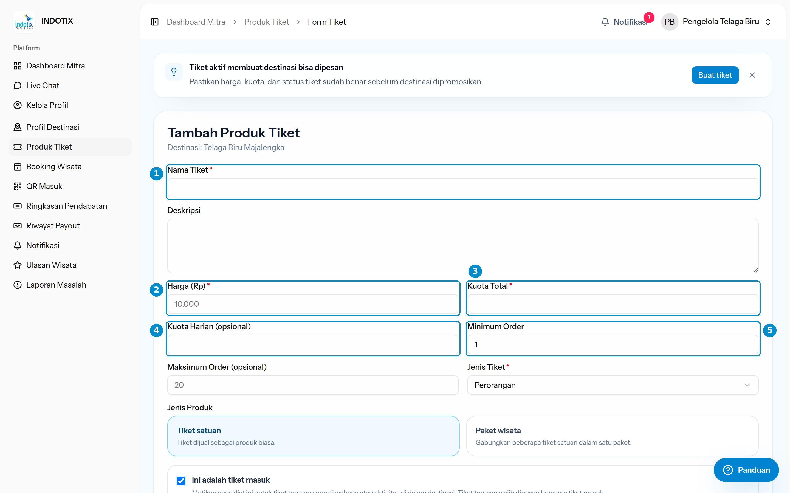

**1. Nama Tiket**
Contoh: Tiket Masuk Reguler.

**2. Harga**
Masukkan harga dalam rupiah; nilai tidak boleh negatif.

**3. Kuota Total**
Isi kapasitas tiket.

**4. Kuota Harian**
Isi batas harian bila diperlukan.

**5. Batas pembelian**
Atur minimum dan maksimum pesanan dalam rentang 1-20 tiket.

### Mengatur jenis dan masa berlaku

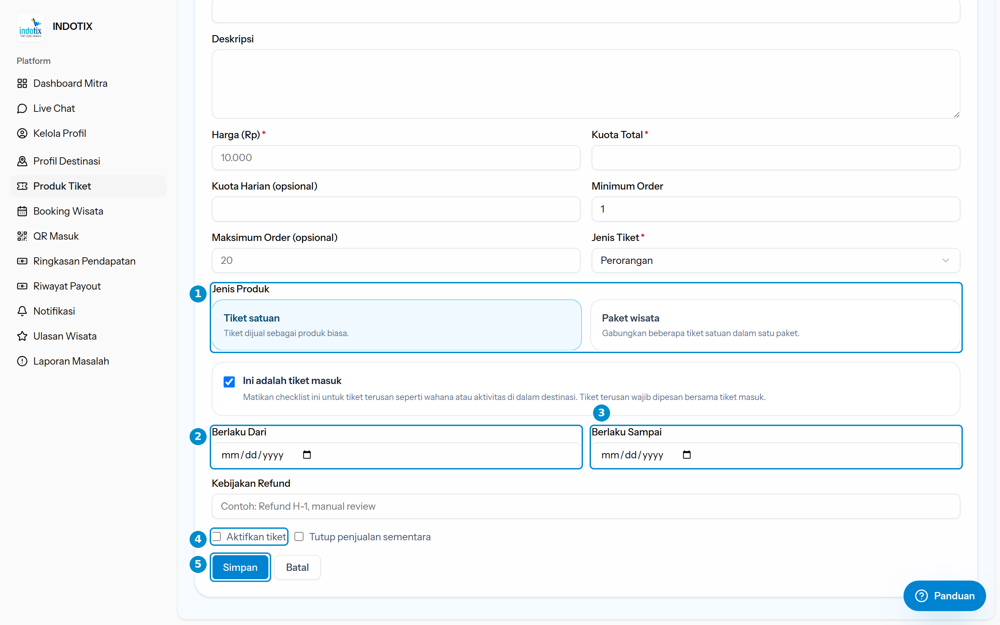

**1. Jenis Produk**
Pilih Tiket satuan atau Paket wisata.

**2. Berlaku Dari**
Tanggal awal bila tiket dibatasi periode.

**3. Berlaku Sampai**
Tanggal akhir periode.

**4. Aktifkan tiket**
Aktifkan produk yang siap dijual.

**5. Simpan**
Simpan tiket setelah semua data diperiksa.

### Menyusun paket wisata

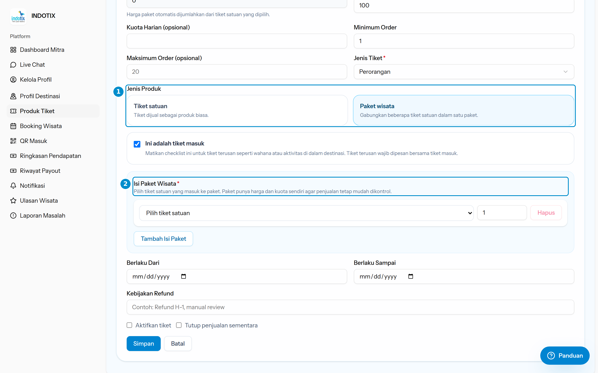

**1. Paket wisata**
Gabungkan tiket satuan milik destinasi yang sama.

**2. Isi Paket Wisata**
Pilih tiket komponen dan jumlahnya; harga dihitung otomatis.

### Memeriksa tiket yang tersimpan

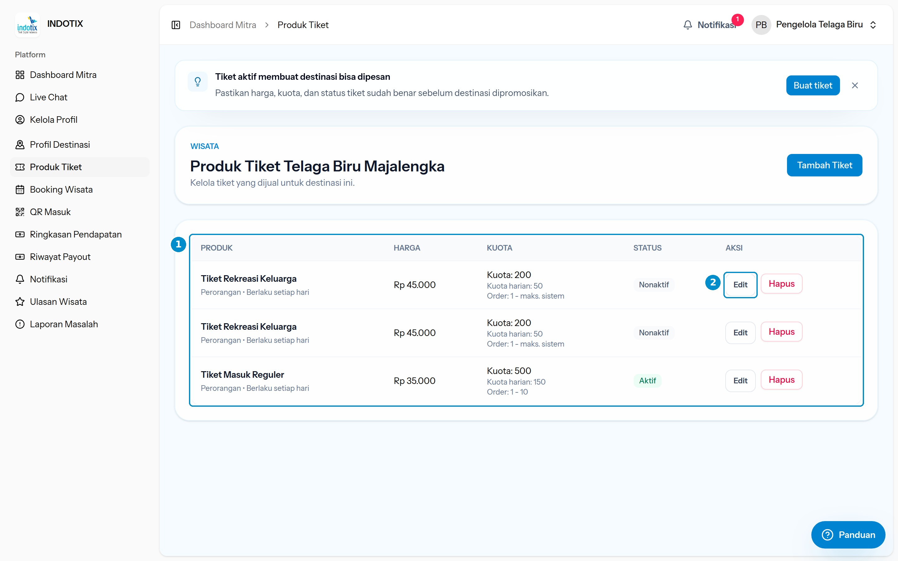

**1. Tiket tersimpan**
Cari tiket baru dan periksa harga, kuota, serta status.

**2. Edit**
Buka kembali produk untuk memperbarui data.

### Mengonfirmasi penghapusan tiket

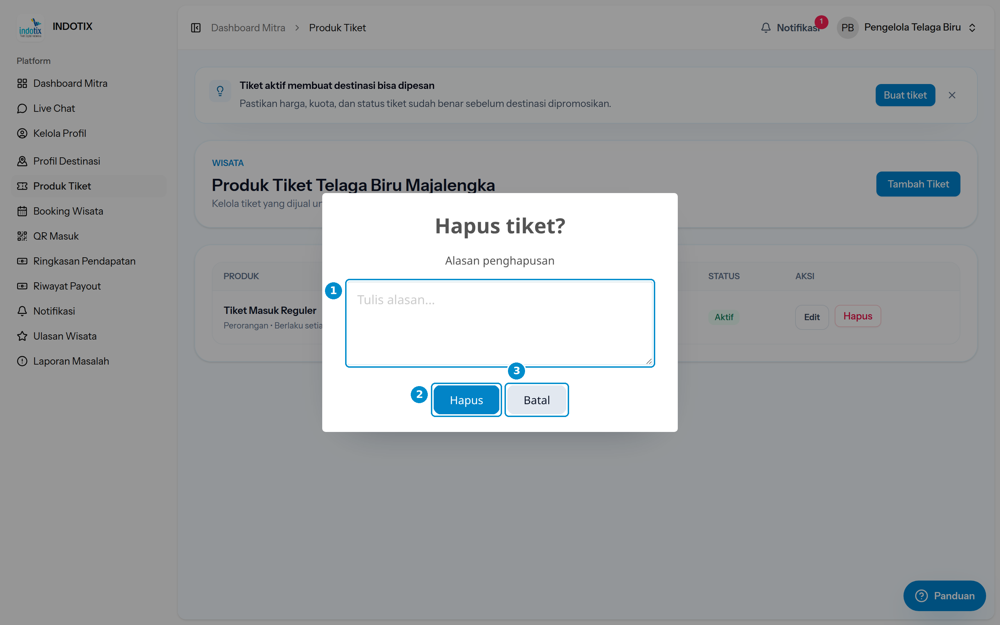

**1. Alasan penghapusan**
Jelaskan alasan penghapusan; jangan hapus produk yang masih diperlukan.

**2. Hapus**
Konfirmasi penghapusan hanya setelah yakin.

**3. Batal**
Kembali tanpa menghapus tiket.

## 08 Memantau booking wisata

### Tujuan

Temukan pesanan dan cocokkan rincian sebelum menangani pertanyaan pengunjung.

### Cara mengakses

Menu Booking Wisata

### Langkah penggunaan

1. Pilih Tanggal kunjungan dan Status yang diperlukan, lalu klik Filter.
2. Gunakan jumlah data per halaman dan navigasi pagination untuk menelusuri daftar.
3. Klik Detail pada booking yang dimaksud.
4. Cocokkan kode booking, tanggal, jumlah dan jenis tiket, harga, total, status serta pemesan. Tinjau Riwayat Dispute bila ada masalah sebelumnya.

**Hasil:** Anda dapat mengidentifikasi pesanan yang benar dan memahami statusnya.

> **Perhatian:** Pending Payment berarti menunggu pembayaran; Paid berarti dibayar; Completed berarti selesai; Cancelled berarti dibatalkan; Expired berarti kedaluwarsa. Mitra tidak memiliki tombol konfirmasi pembayaran manual, pembatalan, atau refund pada halaman ini.

### Menyaring booking wisata

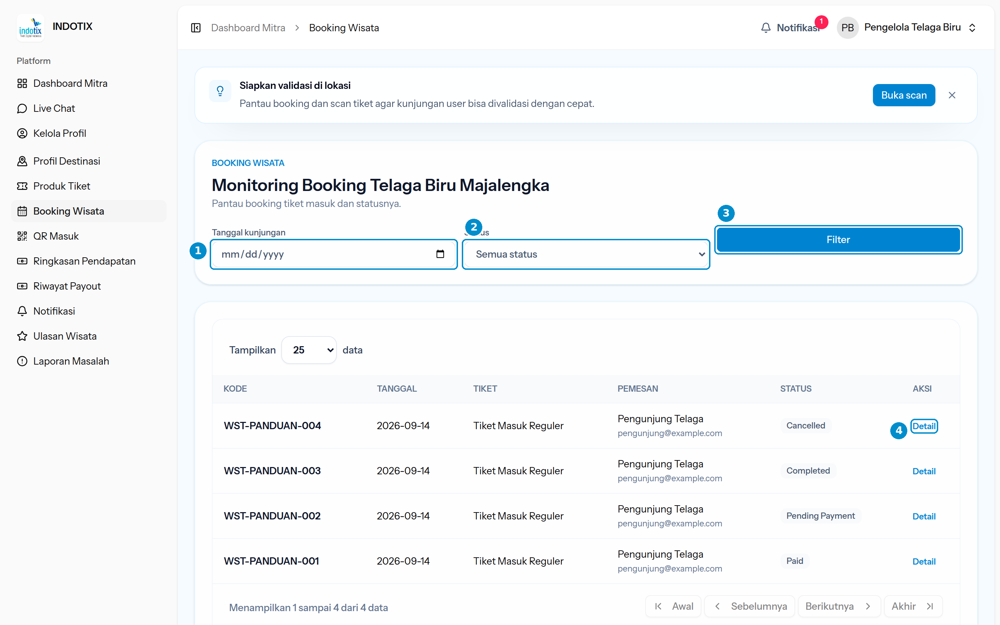

**1. Tanggal kunjungan**
Batasi daftar berdasarkan tanggal kunjungan.

**2. Status**
Pilih status pembayaran/booking yang ingin dilihat.

**3. Filter**
Terapkan pilihan.

**4. Detail**
Buka rincian booking pada baris yang dipilih.

### Memeriksa detail pesanan

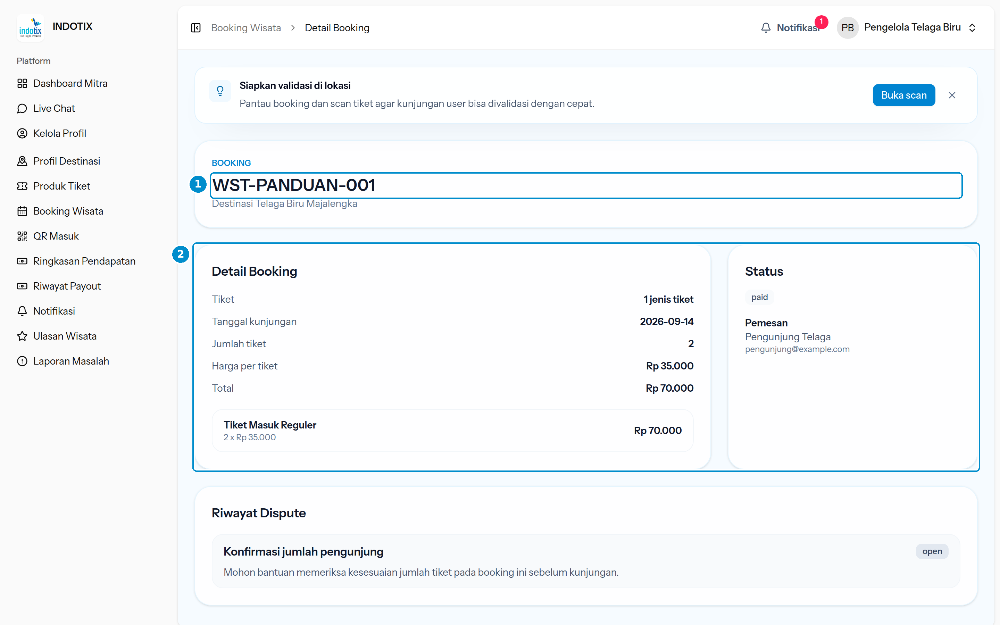

**1. Kode booking**
Pastikan kode sesuai booking pengunjung.

**2. Rincian tiket**
Cocokkan jenis tiket, jumlah, harga satuan, subtotal, status dan pemesan.

## 09 QR Masuk dan validasi kunjungan

### Tujuan

Sediakan QR destinasi di pintu masuk agar pengunjung dapat memvalidasi tiket miliknya.

### Cara mengakses

Menu QR Masuk → QR Tiket / Data Scan

### Langkah penggunaan

1. Buka tab QR Tiket dan pastikan nama destinasi benar.
2. Klik Unduh PDF untuk menyimpan QR, atau Cetak QR untuk membuka proses cetak.
3. Letakkan hasil cetak di area masuk yang mudah dijangkau. Pastikan QR tidak tertutup dan hasil cetak jelas.
4. Minta pengunjung membuka menu scan pada tiket INDOTIX, memindai QR destinasi, lalu memilih tiket yang akan digunakan.
5. Buka Data Scan untuk memantau hasil. Cari data atau pilih tanggal scan, kemudian klik Filter. Reset menghapus pilihan filter.

**Hasil:** Mitra dapat menyediakan QR Masuk dan memantau catatan validasi pengunjung.

> **Perhatian:** QR ini bukan QRIS dan tidak memproses pembayaran. Sistem mengecek status paid, tanggal kunjungan, dan sisa pemakaian. Jangan mengizinkan masuk hanya berdasarkan gambar QR; periksa hasil validasi. Printer dan kamera perangkat pengunjung perlu disiapkan di lokasi.

### Menyiapkan QR Masuk di lokasi

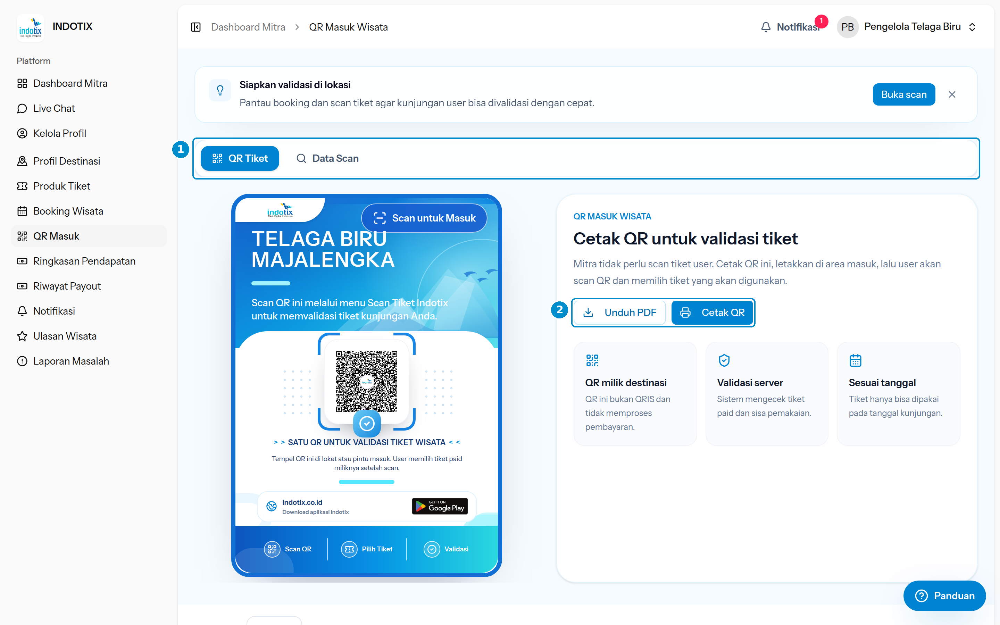

**1. QR Tiket / Data Scan**
Pilih preview QR atau riwayat validasi.

**2. Unduh PDF / Cetak QR**
Simpan atau cetak QR untuk dipasang di pintu masuk.

### Memantau penggunaan tiket

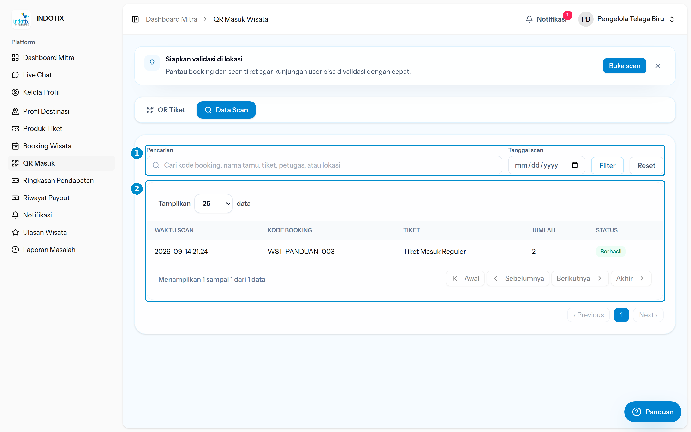

**1. Pencarian dan tanggal scan**
Cari booking/pengunjung atau batasi tanggal; Filter menerapkan, Reset menghapus pilihan.

**2. Data Scan**
Periksa waktu, kode booking, tiket, jumlah dan hasil validasi.

## 10 Pendapatan dan payout

### Tujuan

Pantau nilai penjualan serta pembagian pendapatan yang tercatat.

### Cara mengakses

Menu Ringkasan Pendapatan / Riwayat Payout

### Langkah penggunaan

1. Buka Ringkasan Pendapatan untuk melihat Total Booking, Pendapatan Kotor, dan Pendapatan Bersih.
2. Periksa Detail Komisi dan skema yang ditampilkan. Nilai contoh pada panduan tidak menentukan tarif kerja sama Anda.
3. Buka Riwayat Payout untuk memantau pencairan yang dibuat admin. Mitra melengkapi rekening pada dokumen/profil destinasi.
4. Jika riwayat kosong atau tidak dapat dimuat, hubungi admin untuk konfirmasi periode dan status pencairan.

**Hasil:** Anda dapat membedakan pendapatan tercatat dari pencairan yang diproses admin.

> **Perhatian:** Ringkasan menghitung booking paid/completed, bukan saldo bank. Tidak ada tombol pengajuan pencairan, filter periode, atau export pada halaman keuangan wisata saat audit. Riwayat Payout berisi data mengalami gangguan tampilan pada versi yang diperiksa; gunakan konfirmasi admin sampai diperbaiki.

### Membaca pendapatan dan komisi

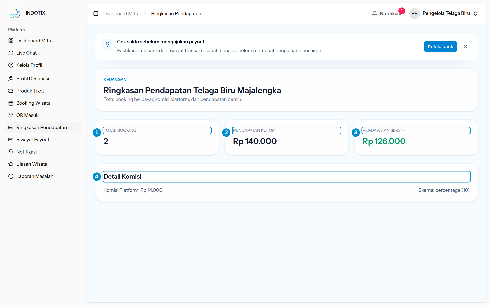

**1. Total Booking**
Jumlah booking berstatus paid atau completed.

**2. Pendapatan Kotor**
Total nilai booking yang diperhitungkan.

**3. Pendapatan Bersih**
Pendapatan kotor dikurangi komisi.

**4. Detail Komisi**
Periksa komisi platform dan skema yang berlaku.

### Mengakses riwayat payout

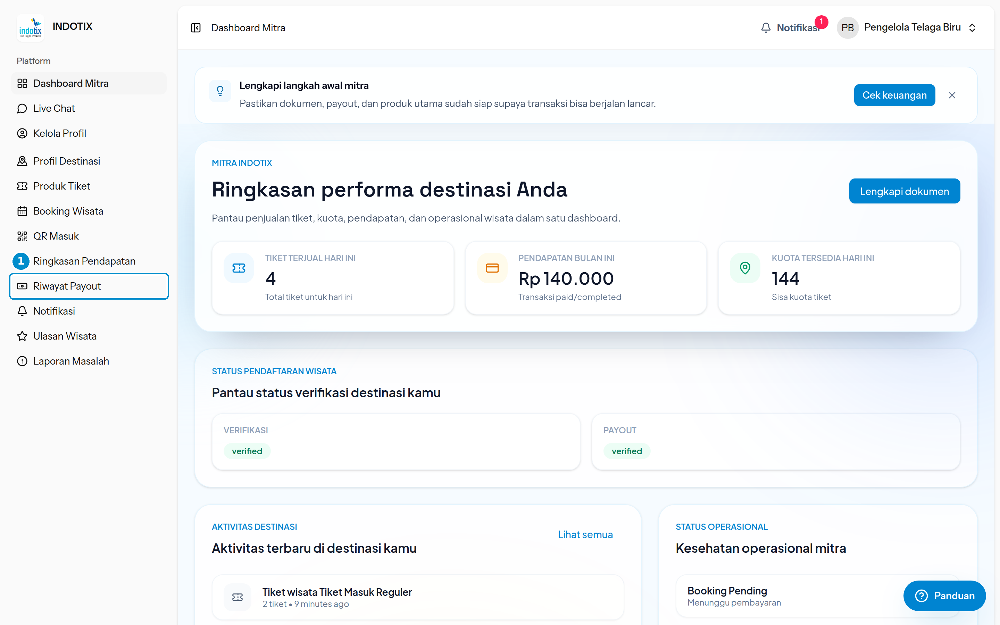

**1. Riwayat Payout**
Menu untuk melihat pencairan yang dibuat admin. Jika halaman kosong, hubungi admin.

## 11 Membaca notifikasi

### Tujuan

Tinjau pembaruan booking dan informasi operasional yang masuk ke akun.

### Cara mengakses

Menu Notifikasi

### Langkah penggunaan

1. Buka Update Terbaru.
2. Baca judul, isi pesan, dan waktunya. Penanda Baru menunjukkan pesan yang belum ditandai terbaca.
3. Jika pesan terkait booking atau tiket, buka menu terkait untuk memeriksa data rinci.

**Hasil:** Anda mengetahui pembaruan penting yang perlu ditindaklanjuti.

> **Perhatian:** Halaman memuat sampai 50 notifikasi terbaru. Jangan menganggap pesan notifikasi sebagai pengganti pemeriksaan status booking.

### Membaca notifikasi

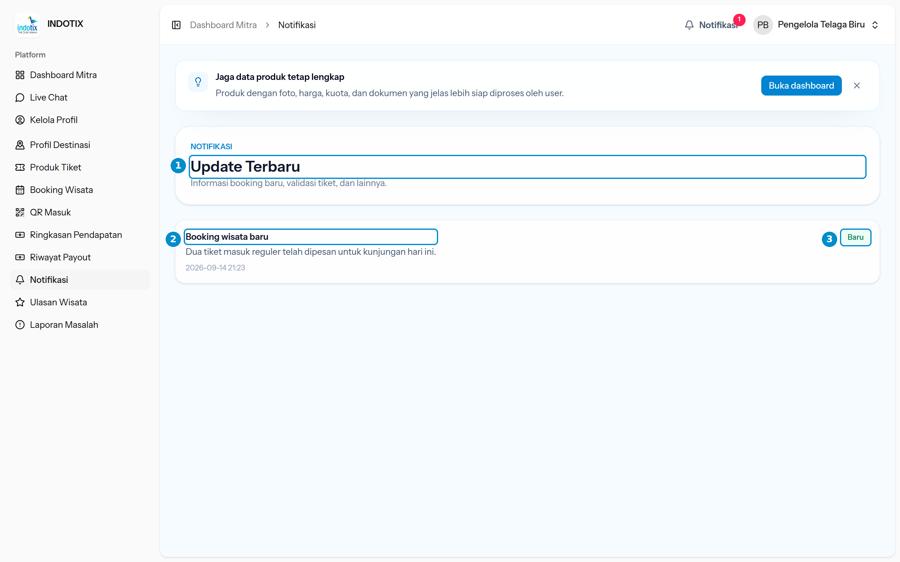

**1. Update Terbaru**
Baca informasi terbaru terkait akun dan operasional.

**2. Judul notifikasi**
Baca rincian pesan dan waktu di bawah judul.

**3. Baru**
Menandai notifikasi yang belum terbaca.

## 12 Menanggapi ulasan pengunjung

### Tujuan

Gunakan ulasan sebagai masukan untuk layanan destinasi.

### Cara mengakses

Menu Ulasan Wisata

### Langkah penggunaan

1. Baca rating dan komentar pada baris ulasan yang dimaksud.
2. Klik Balas, tulis tanggapan yang sopan dan relevan, lalu klik Kirim. Balasan maksimal 1.000 karakter.
3. Periksa kembali balasan yang tampil pada ulasan.
4. Gunakan Hapus hanya bila diperlukan dan periksa dialog konfirmasinya sebelum melanjutkan.

**Hasil:** Balasan tersimpan pada ulasan pengunjung.

> **Perhatian:** Saat audit, angka total pagination dapat tidak sesuai jumlah ulasan yang terlihat. Gunakan baris ulasan sebagai acuan dan laporkan ketidaksesuaian kepada admin.

### Menanggapi ulasan

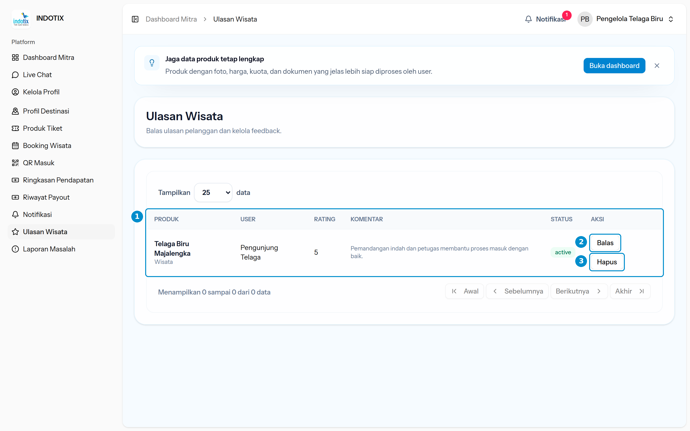

**1. Daftar ulasan**
Lihat produk, pengunjung, rating dan komentar.

**2. Balas**
Buka formulir tanggapan untuk ulasan yang dipilih.

**3. Hapus**
Gunakan secara hati-hati untuk ulasan yang perlu ditindaklanjuti.

### Mengirim balasan ulasan

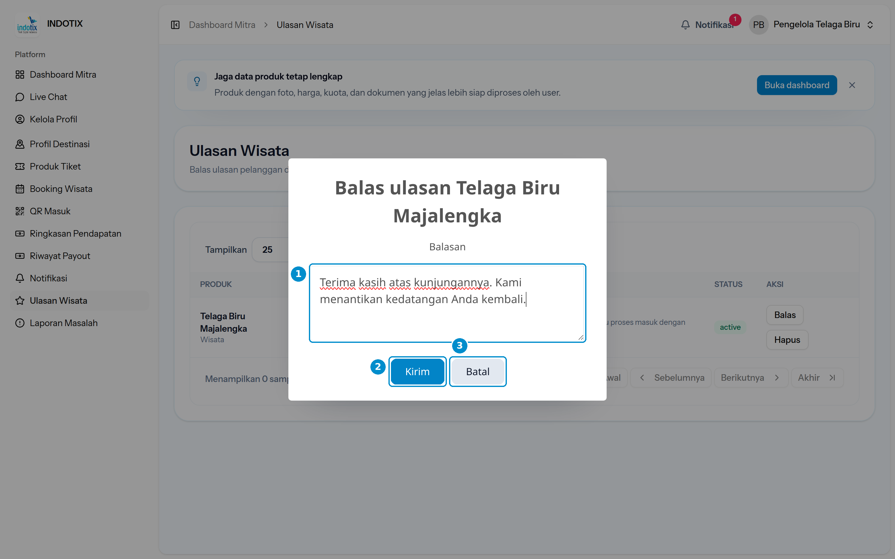

**1. Balasan**
Tulis tanggapan yang sopan dan relevan.

**2. Kirim**
Simpan balasan untuk ulasan ini.

**3. Batal**
Tutup tanpa mengirim.

## 13 Laporan masalah dan Live Chat

### Tujuan

Sampaikan kendala booking kepada admin dan tanggapi percakapan pengunjung.

### Cara mengakses

Menu Laporan Masalah / Live Chat

### Langkah penggunaan

1. Pada Laporan Masalah, pilih booking, isi Subjek dan Deskripsi yang jelas.
2. Lampirkan bukti jika diperlukan: JPG/JPEG/PNG/PDF maksimal 5 MB. Klik Kirim Laporan.
3. Periksa laporan pada tabel dan pantau statusnya: open, investigating, resolved atau rejected.
4. Pada Live Chat, pilih percakapan, tulis Pesan, kemudian klik Kirim.
5. Untuk bantuan penggunaan halaman, klik Panduan. Gunakan Lanjut, Sebelumnya, atau tombol tutup.

**Hasil:** Laporan masuk untuk ditinjau admin dan balasan chat tersimpan pada percakapan.

> **Perhatian:** Pilihan booking laporan mencakup 50 booking terbaru. Deskripsi maksimal 2.000 karakter; chat juga maksimal 2.000 karakter. Jangan mengirim password, kode verifikasi, atau data rahasia melalui chat.

### Membuat laporan masalah

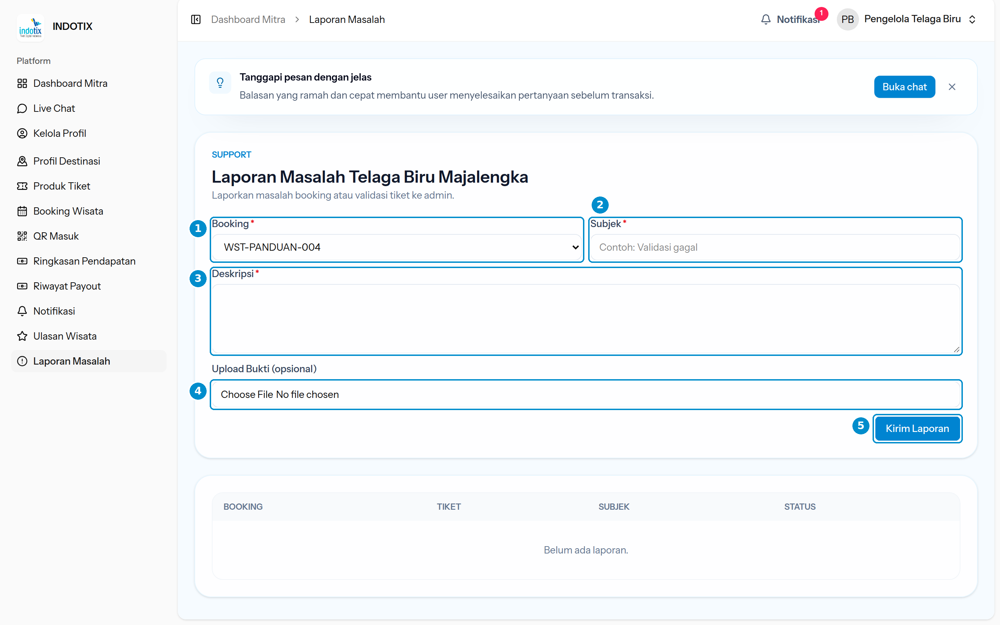

**1. Booking**
Pilih booking yang mengalami masalah.

**2. Subjek**
Tuliskan ringkasan masalah.

**3. Deskripsi**
Jelaskan kejadian, tanggal, dan bantuan yang dibutuhkan.

**4. Bukti opsional**
Lampirkan JPG, PNG, atau PDF maksimal 5 MB.

**5. Kirim Laporan**
Kirim laporan untuk ditinjau admin.

### Memantau laporan yang dikirim

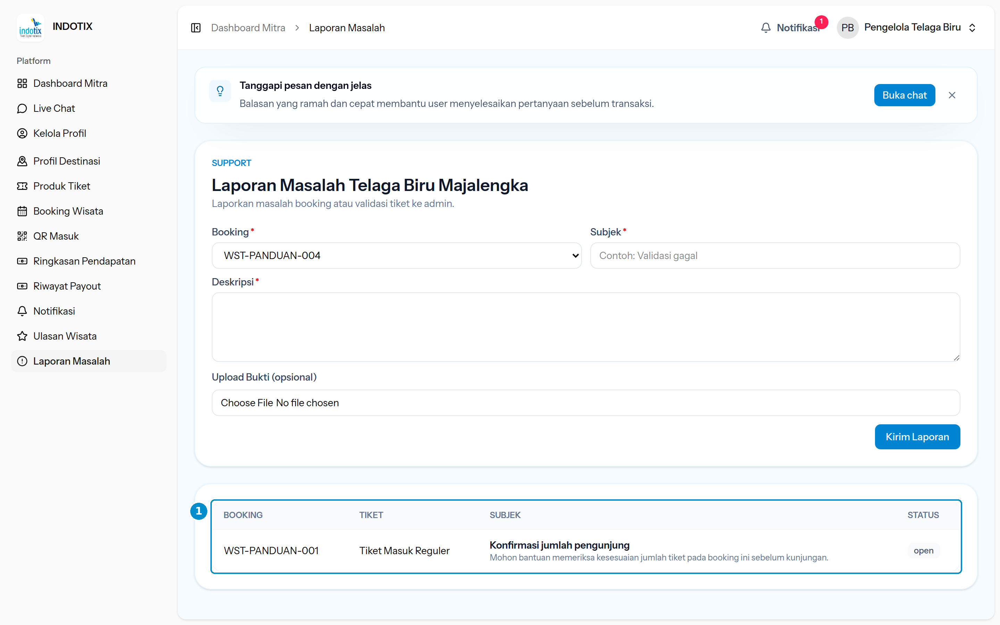

**1. Riwayat laporan**
Periksa booking, subjek, dan status laporan setelah dikirim.

### Membalas percakapan

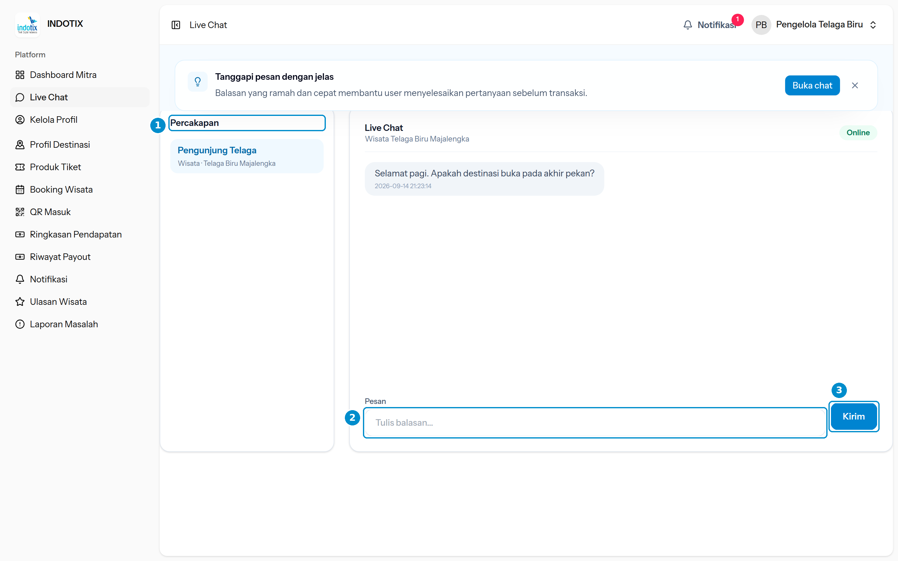

**1. Percakapan**
Pilih percakapan yang ingin ditangani.

**2. Pesan**
Tulis jawaban yang jelas, maksimal 2.000 karakter.

**3. Kirim**
Kirim balasan kepada lawan bicara.

### Membuka panduan interaktif

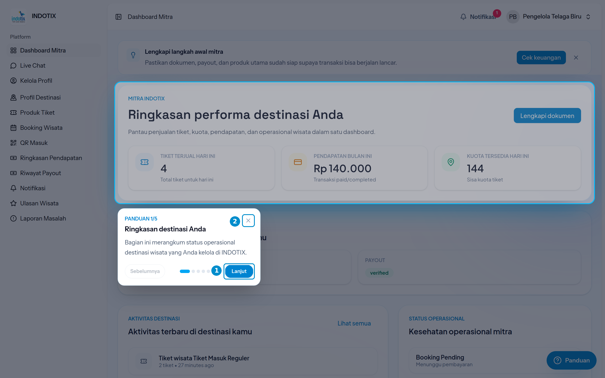

**1. Lanjut**
Lanjutkan ke petunjuk berikutnya.

**2. Tutup panduan**
Tutup petunjuk untuk kembali bekerja.

## 14 Profil, keamanan, dan logout

### Tujuan

Jaga identitas akun dan akses operasional tetap aman.

### Cara mengakses

Menu Kelola Profil / menu akun di kanan atas

### Langkah penggunaan

1. Perbarui Nama Lengkap, Email, Nomor HP, dan Jenis Kelamin bila diperlukan. Klik Simpan Profil.
2. Jika email berubah, selesaikan verifikasi ulang sebelum kembali menggunakan halaman yang dilindungi.
3. Pada Keamanan Akun, isi Password Saat Ini, Password Baru dan Konfirmasi Password, lalu klik Simpan Password.
4. Setelah selesai, buka menu akun di kanan atas dan pilih Log out.

**Hasil:** Profil diperbarui, password dapat diganti, dan sesi berakhir setelah logout.

> **Perhatian:** Gunakan password unik dan jangan berbagi akun. Setelah logout, halaman Mitra meminta login kembali. Tidak ada penghapusan akun Mitra mandiri pada halaman profil ini.

### Memperbarui data akun

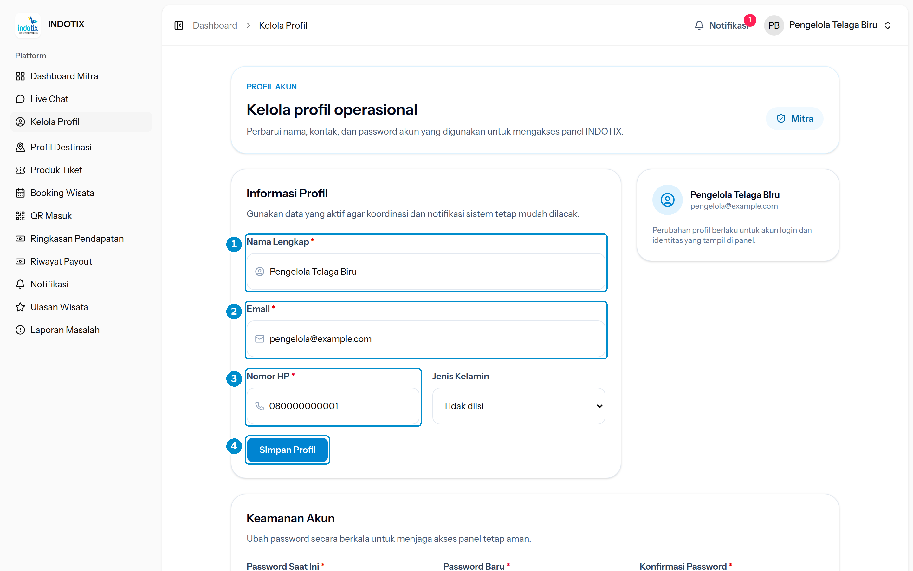

**1. Nama Lengkap**
Perbarui nama pemilik akun operasional.

**2. Email**
Gunakan email aktif; perubahan email memerlukan verifikasi ulang.

**3. Nomor HP**
Isi nomor yang dapat dihubungi.

**4. Simpan Profil**
Simpan dan periksa pemberitahuan Profil tersimpan.

### Mengganti password

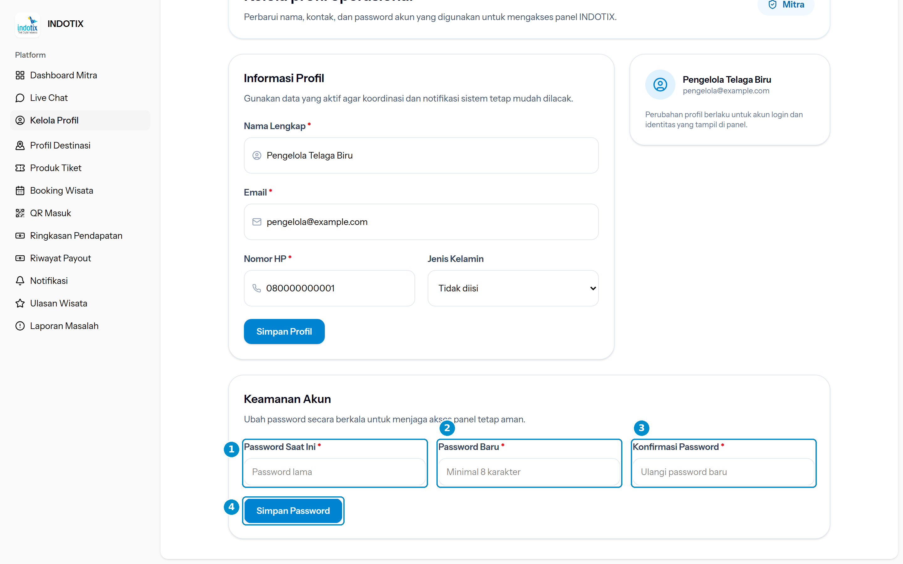

**1. Password Saat Ini**
Masukkan password yang sedang digunakan.

**2. Password Baru**
Buat password baru yang kuat.

**3. Konfirmasi Password**
Ulangi password baru dengan tepat.

**4. Simpan Password**
Simpan untuk mengganti password login.

### Keluar dari akun Mitra

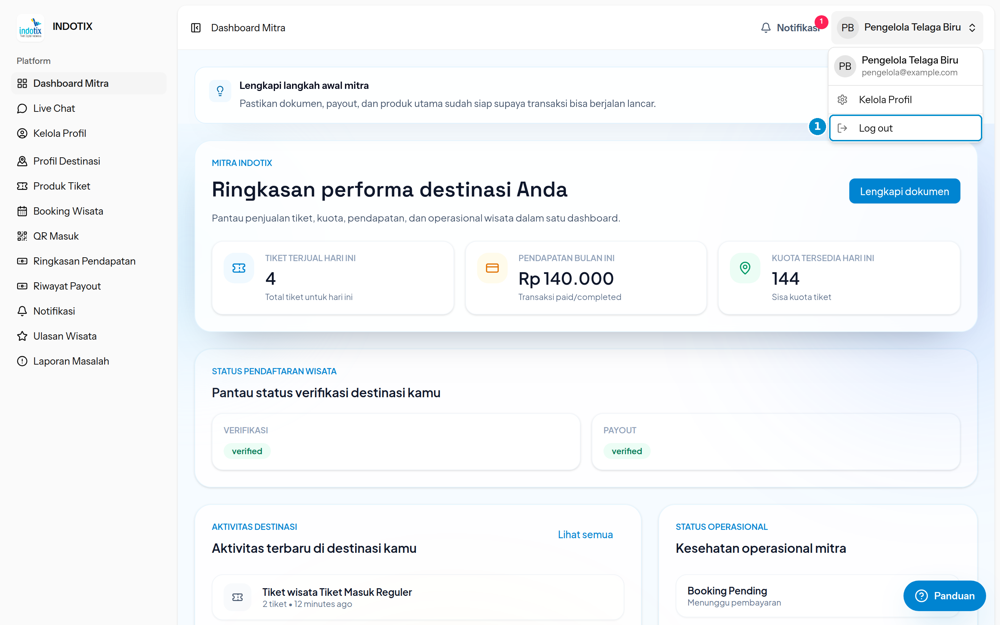

**1. Log out**
Akhiri sesi setelah selesai, terutama di perangkat bersama.

